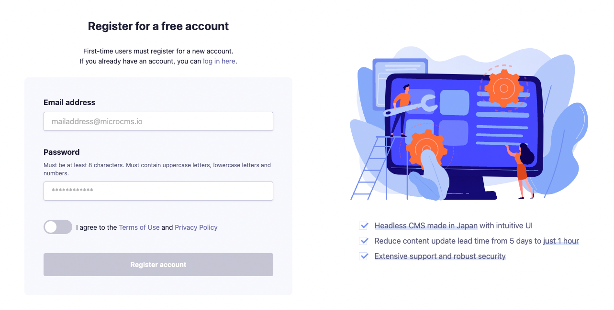
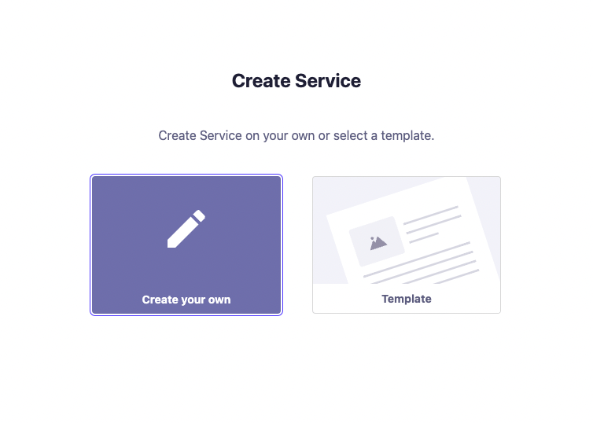

# Simple Blog with microCMS


This is a microCMS official simple blog template.

This blog is built using microCMS, a headless CMS made in Japan, and Next.js.

You are free to enter the following information in this blog.
- Blog body (& its meta information)
- Author
- Tags

## Demo
https://simple-blog-with-microcms.vercel.app/

## Deploy to Vercel
deploy the example using Vercel:

[](https://vercel.com/new/clone?demo-description=This%20is%20a%20microCMS%20official%20simple%20blog%20template.&demo-image=https://github.com/microcmsio/simple-blog-with-microcms/blob/main/public/cover.png?raw=true&demo-title=Simple%20Blog%20with%20microCMS&demo-url=https://simple-blog-with-microcms.vercel.app/&from=templates&project-name=Simple%20Blog%20with%20microCMS&repository-name=Simple%20Blog%20with%20microCMS&repository-url=https://github.com/microcmsio/simple-blog-with-microcms&env=MICROCMS_API_KEY,MICROCMS_SERVICE_DOMAIN,BASE_URL)


## System Requirements

Node.js 18 or above

## Environmental Variables

Create a `.env` file directly under root and enter the following information

```
MICROCMS_API_KEY=xxxxxxxxxx
MICROCMS_SERVICE_DOMAIN=xxxxxxxxxx
BASE_URL=xxxxxxxxxx
```

`MICROCMS_API_KEY`
You can check it from the microCMS dashboard under "Service Settings > API Keys".

`MICROCMS_SERVICE_DOMAIN`
The xxxxxxxxxx part of the microCMS dashboard URL (https://xxxxxxxx.microcms.io).

`BASE_URL`
The URL to deploy to. Please describe it from the protocol.

例）
development → http://localhost:3000
production → https://xxxxxxxx.vercel.app/ etc.

## Installation

1. Install package

```bash
npm install
```

2. Launch the development environment

```bash
npm run dev
```

3. Access to development environment
   Access to [http://localhost:3000](http://localhost:3000)

---

## [microCMS](https://microcms.io/en) Setup

1. Go to [https://app.microcms.io/signup](https://app.microcms.io/signup) to create an account.You can also set your language preference to English at https://app.microcms.io/profile/language.

   

2. Go to [https://app.microcms.io/create-service](https://app.microcms.io/create-service) to create a service. When creating a service, please select "Create your own".

   

3. Create APIs as follows

   Create three list format APIs.

   - writer
   - tag
   - blog
   
---

   ```
   # writer （List Format API）

   This is an API for registering authors of blogs.
   The writer API has three fields. They are as follows.
      
   - Field ID: name(Field Type: Text Field)...Author's Name.
   - Field ID: profile(Field Type: Text Area)...Author's profile text.
   - Field ID: image(Field Type: Image)...Author's image.
   ```

   The following capture is an example of the settings.

   

   ```
   # tag （List Format API）

   This is an API for registering tags for blog content.
   The tag API has one field. They are as follows.

   - Field ID: name(Field Type: Text Field)...Tag Name.
   ```

   The following capture is an example of the settings.

   

   ```
   # blog （List Format API）

   This is an API for registering blog contents.
   The blog API has six fields. They are as follows.

   - Field ID: title(Field Type: Text Field)...Blog title.
   - Field ID: description(Field Type: Text Area)...Blog description.
   - Field ID: content(Field Type: Rich Text Editor)...Blog body.
   - Field ID: thumbnail(Field Type: Image)...Blog thumbnail.
   - Field ID: tags(Field Type: Multiple Content References - tag)...Blog tag.
   - Field ID: writer(Field Type: Content Reference - writer)...Blog writer.
   ```

   The following capture is an example of the settings.

   

5. Create and publish tag, writer, and blog content.

# Appendix
## Page Preview Settings

In order to preview draft content, a page preview must be set up in the microCMS administration page.

Set the following in "API Settings > Page Preview" of the Blog API.

Replace `your-domain` with your deployed domain. (It also works with localhost)


Once set, the page preview button will be available on the content editing page.
